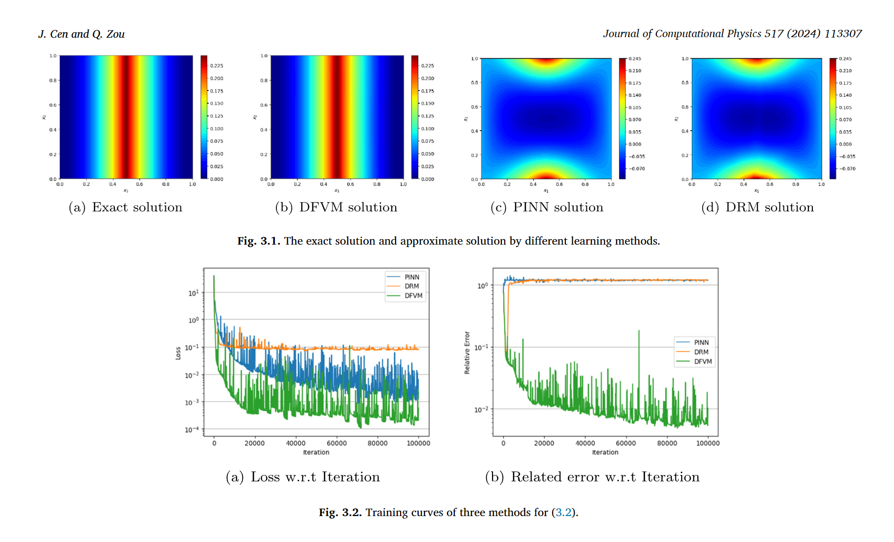

# Deep finite volume method for partial differential equations论文整理

## 理论推导

### 微分方程一般形式:


### DFVM


#### 神经网络结构

```math
u_\theta(x) = K_\theta(x)
```
> 其中$K_\theta$为神经网络构成的映射关系

<div align="center">  </div>
<div align="center">  </div>


#### 损失函数
```math
J(u_\theta) = J^{int}(u_\theta)+\lambda J^{bd}(u_\theta)
```

## 流程图
<div align="center">  </div>

## 代码框架

```c++
class PoissonEQuation(object):
\*
*f:
*g:
*interior:Sampling inside the domain
*boundary:Boundary sampling
*neighborhood: Randomly sample bdsize points within the neighborhood of point x
*neighborhoodBD: Randomly sample bdsize points within the neighborhood of point x
*outerNormalVec:
*\

```

```c++
class DFVMsolver(object):
\*
*Nu:Compute the divergence of u = u_theta
*integrate_BD：Compute the boundary integral for each sample point neighborhood
*integrate_F:Compute the volume integral
*loss_boundary:Boundary loss function
*\
```
## 计算案例
### 1 Possion eqution
<div align="center">  </div>

```c++
def f(self, X):
    f = -2 * torch.ones(len(X), 1).to(self.device)
    return f.detach()

def g(self, X):
    x = X[:, 0]
    u = torch.where(x < 0.5, x.pow(2), (x - 1).pow(2))
    return u.reshape(-1, 1).detach()
```
### 论文计算结果
<div align="center">  </div>

### 复现结果

<div align="center">  </div>

### 2 biharmonic equation
<div align="center">  </div>


```math
\left\{
\begin{aligned}
&\Delta v = f \quad in\Omega\\
&v = -\frac{\pi^2}{4}\Sigma^2_{k=1}sin(\frac{\pi}{2}x_k) \quad on\partial \Omega \\
\end{aligned}
\right. 
```
```c++
def f(self, X):
        x = torch.sin(torch.pi*X/2)
        a = torch.sum(x,1)/16
        f =  pow(torch.pi, 4)*a
        return f.detach()

def g(self, X):
        x = torch.sin(torch.pi*X/2)
        a = torch.sum(x,1)
        g = -a*pow(torch.pi,2)/4
        return g.detach()
```
```math
\left\{
\begin{aligned}
&\Delta u = v \quad in\Omega\\
&u = \Sigma^2_{k=1}sin(\frac{\pi}{2}x_k) \quad on\partial \Omega \\
\end{aligned}
\right. 
```


```c++
    def f(self, X):
        v = self.model_v(X)
        f = v
        return f.detach()

    def g(self, X):
        x = torch.sin(torch.pi*X/2)
        u = torch.sum(x,1)
        g = u
        return g.detach()
```
#### 理论解
<div align="center">  </div>

#### DFVM获得的解
<div align="center">  </div>